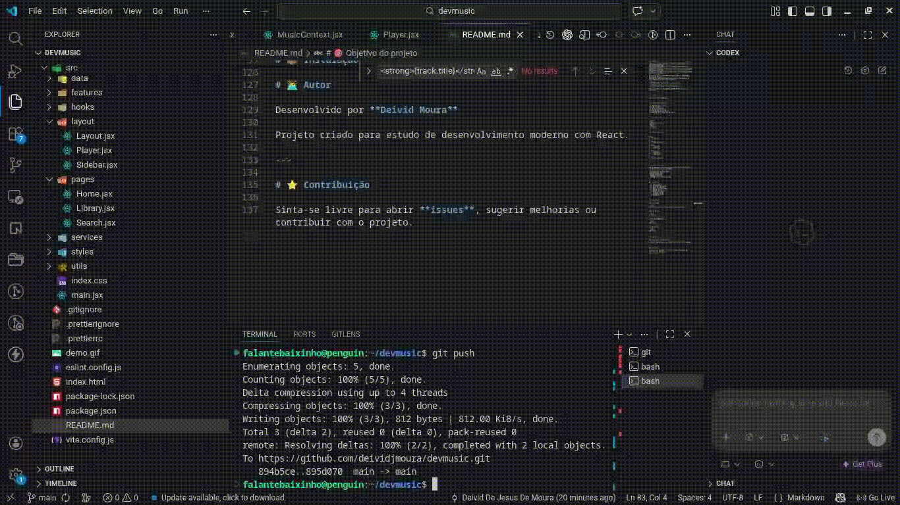

# 🎵 DevMusic

Um aplicativo de streaming de música inspirado em plataformas modernas de música.

O objetivo do projeto é criar uma experiência semelhante a um player moderno, permitindo que usuários:

* façam **upload de músicas**
* **ouçam músicas enviadas por outros usuários**
* **curtam músicas**
* construam sua própria **biblioteca musical**

Tudo isso usando uma arquitetura moderna baseada em **React + Firebase**.

---

# 🚀 Preview




---

# ✨ Funcionalidades atuais

* 🎧 Player global de música
* ⏯ Play / Pause
* ⏱ Barra de progresso
* 🎼 Biblioteca de músicas
* 🔁 Troca de música ao clicar
* ⚡ Atualização em tempo real do player

---

# 🧠 Tecnologias usadas

* React
* Vite
* Firebase *(em breve)*
* ESLint
* Husky
* Commitizen

---

# 📁 Estrutura do projeto

```
src
 ├ app
 │   └ App.jsx
 │
 ├ context
 │   └ MusicContext.jsx
 │
 ├ layout
 │   ├ Layout.jsx
 │   └ Player.jsx
 │
 ├ pages
 │   ├ Home.jsx
 │   ├ Search.jsx
 │   └ Library.jsx
 │
 └ data
     └ musicLibrary.js
```

---

# 🎯 Objetivo do projeto

Esse projeto está sendo desenvolvido como **estudo de arquitetura de aplicações modernas**, incluindo:

* gerenciamento de estado global
* reprodução de áudio
* upload de arquivos
* backend serverless
* integração com storage em nuvem

---

# 🛠 Roadmap

Próximas funcionalidades planejadas:

* [ ] Upload de músicas
* [ ] Integração com Firebase Storage
* [ ] Sistema de curtidas
* [ ] Perfil de usuário
* [ ] Playlist
* [ ] Player com next / previous
* [ ] Volume control
* [ ] Capa do álbum

---

# 📦 Instalação

Clone o projeto

```bash
git clone https://github.com/deividjmoura/devmusic.git
```

Entre na pasta

```bash
cd devmusic
```

Instale as dependências

```bash
npm install
```

Rode o projeto

```bash
npm run dev
```

---

# 👨‍💻 Autor

Desenvolvido por **Deivid Moura**

Projeto criado para estudo de desenvolvimento moderno com React.

---

# ⭐ Contribuição

Sinta-se livre para abrir **issues**, sugerir melhorias ou contribuir com o projeto.
